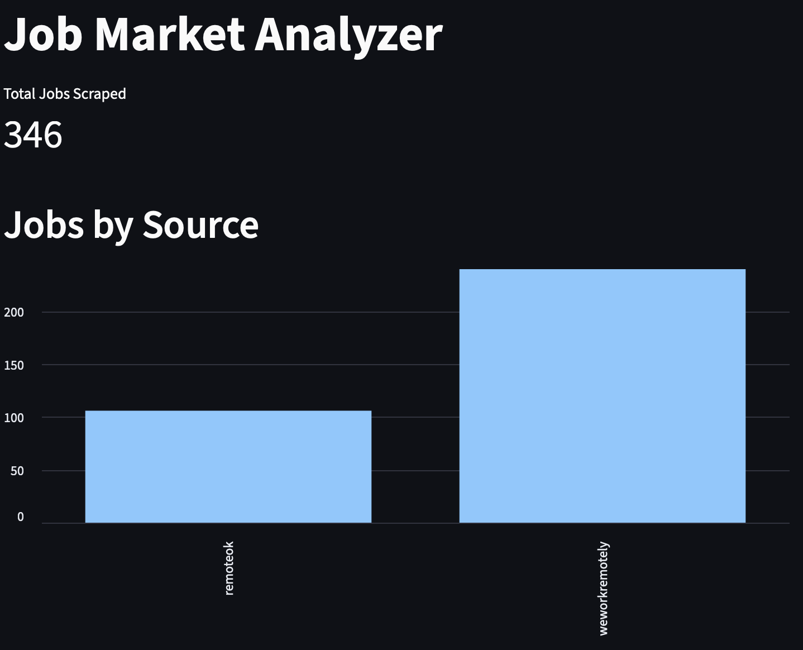
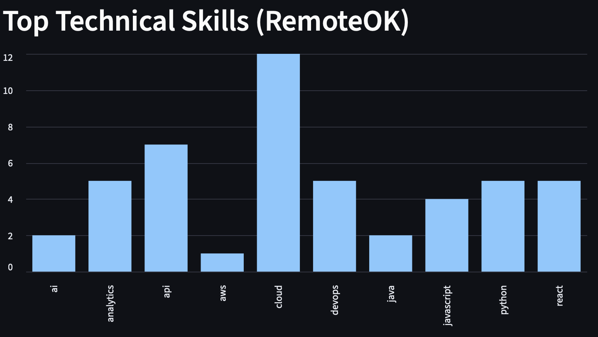
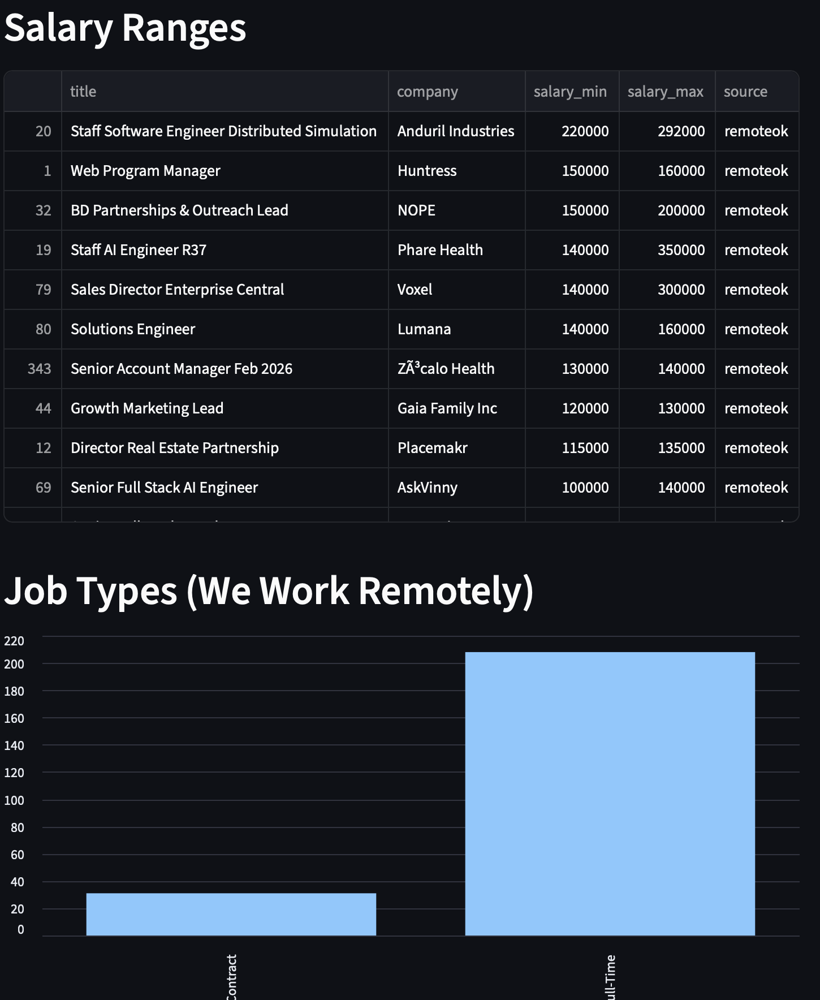
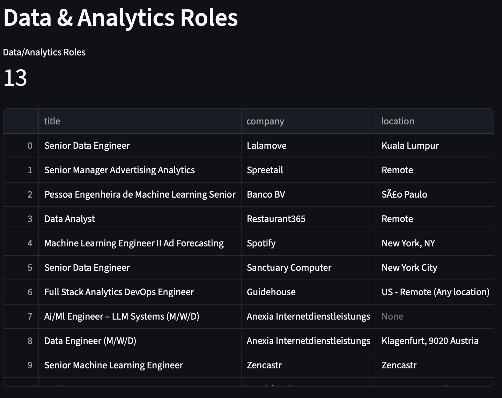

# Job market analysis

**An analysis of data science and data analyst job market trends**

---

## Project Overview

This project creates a pipeline that scrapes job data from the websites remoteok.com and weworkremotely.com, cleans the data, and presents it on a dashboard for insights.

## Project structure

```
job_scraper/
│
├── analysis/
│   └── analyze.py              # Exploratory data analysis
│
├── dashboard/
│   └── app.py                  # Streamlit dashboard
│
├── data/
│   └── jobs.db                 # SQLite database (not tracked in git)
│
├── create_db.py                # Database schema setup
├── remote_scraper.py           # RemoteOK scraper
├── wwr_scraper.py              # We Work Remotely scraper
├── scraper.py                  # Practice scraper (fake jobs)
├── requirements.txt            # Python dependencies
├── .gitignore                  # Git exclusions
└── README.md                   # You are here
```

---

## 🚀 Quick Start

### Prerequisites
- Python 3.10+

### Installation
```bash
# Clone the repository
git clone https://github.com/boyeshenry-byte/job_market_analyzer.git
cd job_scraper

# Install dependencies
pip install -r requirements.txt
```


### Running the Analysis

Execute in order:
1. **create_db.py** - Creates a database to house data
2. **remote_scraper.py** and  **wwr_scraper.py** - Scrapes and cleans data for analysis
3. **app.py** - Creates a dashboard for visualizing job trends

---

## Dashboard Preview





## 🛠️ Technologies Used

**Core Libraries:**
- `pandas` - Data manipulation
- `numpy` - Numerical computing
- `sqlalchemy` - Create databases
- `streamlit` - Build dashboard
- `requests ` - Fetch urls
- `BeautifulSoup` - Scrape html data
- `plotly` - Visualize findings

## 👤 Author

**Henry Boyes**
- GitHub: [@boyeshenry-byte](https://github.com/boyeshenry-byte)
- LinkedIn: [Henry Boyes](https://linkedin.com/in/hboyes)
- Email: boyeshenry@gmail.com

---

## 📄 License

This project is licensed under the MIT License - see the [LICENSE](LICENSE) file for details.

---

## 🙏 Acknowledgments

- **Data Sources:** [RemoteOK](https://remoteok.com) & [WeWorkRemotely](https://weworkremotely.com)
- **Inspiration:** Understanding the job market of my field

---

## 📞 Questions?

Feel free to open an issue or reach out if you have questions about the methodology or findings!

---

**⭐ If you found this analysis interesting, please consider starring the repository!**
